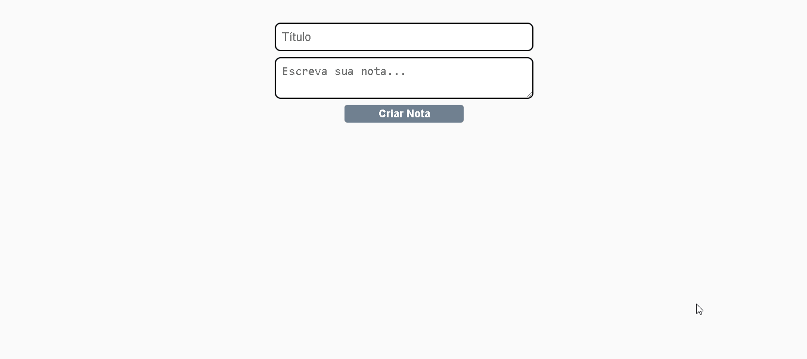

<h1 align="center">
    Notes-app
</h1>

  <a href="#-tecnologias">Tecnologias</a>&nbsp;&nbsp;&nbsp;|&nbsp;&nbsp;&nbsp;
  <a href="#-projeto">Projeto</a>&nbsp;&nbsp;&nbsp;|&nbsp;&nbsp;&nbsp;
  <a href="#-layout">Layout</a>&nbsp;&nbsp;&nbsp;|&nbsp;&nbsp;&nbsp;
  <a href="#memo-licença">Licença</a>

 

## Demo

  
  

  

## 🚀 Tecnologias

This project was develpment with the following technologies

- [React](https://reactjs.org)

## 💻 Projeto

This is a basic project for studying concepts in freamework react js, among them:

- Integrate js into jsx
- Hierarchy between components
- Props
- state and setState

---

Feito com ♥ by Raul Franck :wave: [Entre em contato domigo :)](https://www.linkedin.com/in/raul-franck-468617164/)
